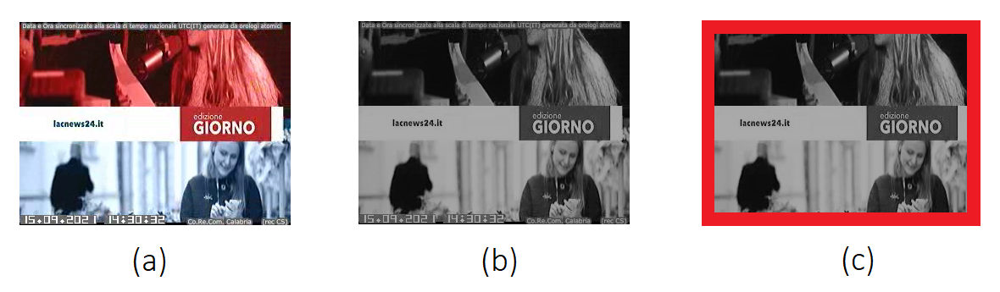

# Image and Video Classification using ResNet50 and SSIM



This project focuses on image and video classification by leveraging deep learning models and similarity-based metrics. It includes two main components:
1. **Training a ResNet50-based classification model**.
2. **Classifying video frames based on similarity and model predictions**.

---

## Features
- **ResNet50 Transfer Learning**: A pre-trained ResNet50 model is fine-tuned for multi-class classification.
- **Structural Similarity (SSIM)**: Utilized to evaluate the similarity between frames and reference images.
- **Data Augmentation**: Includes various augmentation techniques like rotation, zoom, and horizontal flips for robust training.
- **Mask Processing**: Extracts and processes masks for video frame classification.
- **Automated File Handling**: Automatically detects and processes new files.

---

## Project Structure
```
project-directory/
├── train.py             # Script for training the ResNet50-based classifier
├── final_network.py     # Script for processing and classifying video frames
├── README.md            # This file
├── data/                # Directory for the dataset (images and labels)
├── models/              # Directory to store trained models and label binarizers
├── Example_Clips/       # Directory containing example video files for classification
├── DISCRIMINATORI_LAC_RESIZE/ # Reference images for similarity comparison
├── RESULTS/             # Output directory for classification results
└── VIDEO_PATHS.csv      # Tracks processed video paths
```
---

## Requirements

### Python Packages
Install the required packages using pip:

```bash
pip install tensorflow scikit-image numpy pandas matplotlib argparse opencv-python imutils
```

### Additional Dependencies
- **GPU Acceleration**: Install TensorFlow GPU if supported by your system for faster training.
- **Pre-trained ResNet50 weights**: Automatically downloaded by Keras.

---

## Usage

### Training the Model
To train the ResNet50-based model on a custom dataset:
```bash
python train.py --dataset <path-to-dataset> \
                --model models/activity.model \
                --label-bin models/lb.pickle \
                --epochs 50 \
                --plot plot.png
```

- `--dataset`: Path to the dataset folder. Images should be organized in subdirectories by class.
- `--model`: Path to save the trained model.
- `--label-bin`: Path to save the label binarizer.
- `--epochs`: Number of epochs for training.
- `--plot`: Path to save the training loss/accuracy plot.

---

### Classifying Video Frames
To process video frames and classify them using a trained model:

```bash
python final_network.py --model models/activity.model \
                        --label-bin models/lb.pickle \
                        --size 128
```

---

## Dataset Organization

For training:
```plaintext
data/
├── class1/
│   ├── image1.jpg
│   ├── image2.jpg
│   └── ...
├── class2/
│   ├── image1.jpg
│   ├── image2.jpg
│   └── ...
└── ...
```

For video processing:
- Place reference images in `DISCRIMINATORI_LAC_RESIZE/`.
- Place videos in `Example_Clips/`.

---

## Outputs

1. **Trained Model**:
   - Stored in the path specified by `--model`.
2. **Classification Results**:
   - Stored as `.csv` files in the `RESULTS/` directory.
3. **Training Metrics**:
   - Saved as a plot (`plot.png`) showing loss and accuracy trends.

---

## Examples

### Training Example
```bash
python train.py --dataset ./data \
                --model ./models/activity.model \
                --label-bin ./models/lb.pickle \
                --epochs 25 \
                --plot ./plot.png
```

### Video Processing Example
```bash
python final_network.py --model ./models/activity.model \
                        --label-bin ./models/lb.pickle \
                        --size 128
```

---

## Notes
- Ensure that `VIDEO_PATHS.csv` is present to track processed videos.
- Use a GPU for faster processing, especially when training or processing high-resolution videos.

---

## License
This project is licensed under the MIT License. See the `LICENSE` file for details.

---

## Contributors
- **Federico Candela**
- **Maurizio Campolo**
